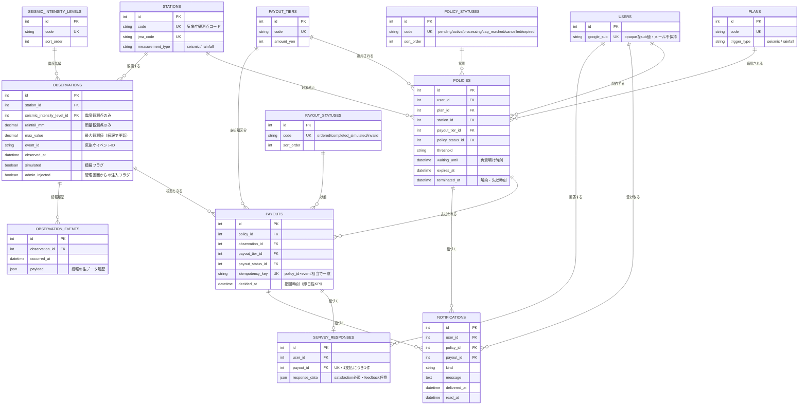

# ER図（実装リバースエンジニアリング）

`src/backend/db/schema.rb`（`version: 2026_07_17_130000`）から起こしたER図です。設計初期段階の [`../parametric-disaster-payout-mvp_design_document.md`](../parametric-disaster-payout-mvp_design_document.md) のER図とは、主キー構成・正規化マスタの分離・追加テーブルの点で異なります。実装の正とするのはこちらです。

## design_document.md のER図との主な相違点

| 項目 | design_document.md（初期設計） | 実装（schema.rb） |
| --- | --- | --- |
| USERS PK | `google_sub` を直接PK | `id`（integer, 連番）。`google_sub` はUK |
| POLICIES/NOTIFICATIONS/SURVEY_RESPONSES の所有者FK | `google_sub FK` | `user_id`（integer FK） |
| STATIONS PK | `station_id`（気象庁コードを直接PK） | `id`。`code`/`jma_code` はUK |
| 契約状態・支払状態・震度階級 | `POLICIES.status` 等の文字列カラム | `policy_statuses` / `payout_statuses` / `seismic_intensity_levels` に正規化 |
| `PAYOUTS.ordered_at` | あり | 実装では `decided_at` |
| 続報履歴 | 設計上は概念のみ | `observation_events` テーブルとして実体化 |
| ジョブキュー基盤 | 記載なし | `solid_queue_*`（Solid Queue、Rails標準のバックグラウンドジョブ基盤。ドメインモデル外のため本図では省略） |
| 隔離データ | 記載なし | `legacy_payouts` / `legacy_survey_responses`（過去の不整合データを隔離した退避テーブル。現行フローでは参照しない） |

DFD・シーケンス図・クラス図・状態遷移図・ユースケース図は概念レベルで実装と大きな乖離がないため、当面は [`../parametric-disaster-payout-mvp_design_document.md`](../parametric-disaster-payout-mvp_design_document.md) を正とする。ただしテーブル・カラムに言及する場合は本図（ER図）を優先すること。
